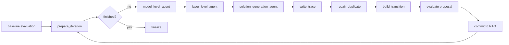
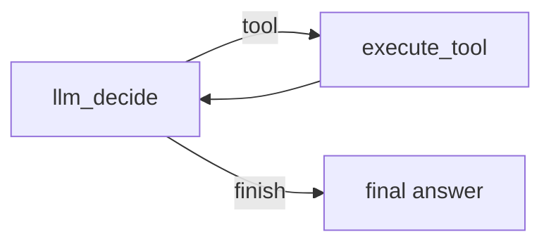

# Chiplet LLM Tuner

An LLM multi-agent + RAG research framework for architecture-parameter tuning of multi-chiplet deep-learning accelerators.

This project uses the Compass multi-chiplet accelerator simulator as the evaluator and builds a LangGraph-based tuning pipeline on top of it. Given per-iteration evaluation reports containing latency, energy, and monetary-cost information, the framework analyzes bottlenecks, retrieves historical tuning cases, and generates the next legal hardware configuration.

## Repository Layout

```text
.
├── chiplet_tuner/              # LLM/RAG tuning framework
│   ├── agents/                 # model-level, layer-level, and solution agents
│   ├── core/                   # schemas, search space, progress, and IO helpers
│   ├── llm/                    # OpenAI-compatible client, prompts, and tracing
│   ├── pipeline/               # LangGraph tuning pipeline
│   ├── rag/                    # embeddings and historical vector store
│   ├── simulators/             # Compass and generic-files adapters
│   └── tools/                  # shared toolbox callable by agents
├── Compass/                    # multi-chiplet accelerator simulator
├── paper/                      # draft of the paper method section
├── main.py                     # CLI entry point
├── requirements.txt            # Python dependencies
└── key.example.json            # example LLM config without real credentials
```

## Method Overview

The framework contains three agents and a shared toolbox:

- **Model-Level Analysis Agent**: identifies globally important candidate bottleneck layers from whole-model execution evidence, including timeline behavior, critical-path position, bubbles, latency share, energy share, monetary cost, and operator-group concentration.
- **Layer-Level Analysis Agent**: performs detailed diagnosis for the candidate layers, describing compute, memory, communication, buffer, and hardware-mapping bottlenecks.
- **Solution-Generation Agent**: combines the bottleneck state, retrieved RAG cases, and hardware-design constraints to generate the next legal hardware configuration through hardware-editing tools.

The outer tuning workflow is implemented with LangGraph:



Each agent uses a shared ReAct subgraph for tool use:



## Installation

A dedicated Conda environment is recommended:

```bash
conda create -n beacon python=3.12
conda activate beacon
pip install -r requirements.txt
```

For offline smoke tests with the mock LLM and hashing embeddings, the full dependency set is not strictly required. For complete experiments with real LLM calls and pretrained embeddings, install `requirements.txt`.

## Preparing Compass

Compass requires a ZigZag Python service and a compiled C++ simulator. See [Compass/readme.md](Compass/readme.md) for the simulator-level instructions.

Start the ZigZag service in one terminal:

```bash
cd Compass/zigzag_call
python3 zigzag_call.py
```

Build Compass in another terminal:

```bash
cd Compass
make
```

After compilation, the simulator binary should be available at:

```text
Compass/build/compass
```

## LLM Configuration

Real LLM calls use an OpenAI-compatible chat-completions endpoint. Start from the example config:

```bash
cp key.example.json key.json
```

Then edit `key.json`:

```json
{
  "mimo": {
    "model": "your-chat-model-name",
    "key": "YOUR_API_KEY",
    "url": "https://your-openai-compatible-endpoint/v1",
    "temperature": 0.2,
    "timeout": 600,
    "return_reasoning": false
  }
}
```

`key.json` is ignored by `.gitignore` and should never be committed.

## Usage

### 1. Analyze an Existing Compass Run

This mode does not invoke Compass again. It reads precomputed evaluation artifacts and runs the three-agent analysis pipeline:

```bash
python3 main.py \
  --simulator generic-files \
  --from-existing Compass/try \
  --hardware Compass/try/hardware_ws.json \
  --metrics-file Compass/try/exec_res.csv \
  --latency-detail Compass/try/exec_latency_detail.json \
  --energy-detail Compass/try/exec_energy_detail.json \
  --mc-detail Compass/try/exec_mc_detail.json \
  --output-dir runs/from_existing_demo
```

If `--llm-config` is omitted, the framework uses the deterministic mock LLM.

### 2. Run Iterative Tuning

Example with a real LLM and BGE embeddings:

```bash
python3 main.py \
  --iterations 3 \
  --workload prefill \
  --dataset sharegpt \
  --compute-scale 64 \
  --llm-config key.json \
  --llm-profile mimo \
  --embedding-model BAAI/bge-small-en-v1.5 \
  --output-dir runs/real_llm_prefill_3iter \
  --history-db runs/real_llm_prefill_3iter/history_vector_db.json
```

Offline mock LLM example:

```bash
python3 main.py \
  --iterations 1 \
  --workload prefill \
  --dataset sharegpt \
  --compute-scale 64 \
  --embedding-model hashing \
  --output-dir runs/mock_smoke \
  --history-db runs/mock_smoke/history_vector_db.json
```

### 3. Resume from a LangGraph Checkpoint

If a run is interrupted, reuse the same `--output-dir` and add `--resume`:

```bash
python3 main.py \
  --iterations 3 \
  --workload prefill \
  --dataset sharegpt \
  --compute-scale 64 \
  --llm-config key.json \
  --llm-profile mimo \
  --embedding-model BAAI/bge-small-en-v1.5 \
  --output-dir runs/real_llm_prefill_3iter \
  --history-db runs/real_llm_prefill_3iter/history_vector_db.json \
  --resume
```

The default checkpoint file is:

```text
runs/.../langgraph_checkpoints.sqlite
```

## Main Outputs

Each run writes artifacts under `--output-dir`:

- `iter_000/`, `iter_001/`, ...: per-iteration evaluation and analysis artifacts.
- `iter_xxx/analysis/agent_trace.json`: structured trace of the three agents.
- `iter_xxx/llm_trace/raw_json/`: raw request/response JSON for each LLM call.
- `iter_xxx/llm_trace/view_md/`: readable per-agent dialogue expansions.
- `history_vector_db.json`: RAG historical-case database.
- `tuning_metrics_table.md`: per-iteration metrics, objective values, and relative changes.
- `timing_summary.md` / `timing_summary.json`: timing statistics for evaluator, agents, RAG, and trace writing.
- `best_hardware.json`: best hardware configuration found so far.
- `langgraph_checkpoints.sqlite`: LangGraph checkpoint database.
- `langgraph_manifest.json`: outer graph and ReAct subgraph manifest.

## Hardware Design Space

The hardware design space follows the Compass BO hierarchy:

- **Compute specification and chiplet count**: choose `chip_size`; derive `num_chiplets`, `chip_x`, `chip_y`, per-chiplet compute array, and buffer size from the total compute budget.
- **Per-chiplet type choice**: after the chiplet count is determined, choose legal chiplet types such as `ws` or `os`.
- **System-level parameters**: tune `dram_bw`, `nop_bw`, `micro_batch`, and `tensor_parall`.

The LLM is not expected to manually maintain derived hardware fields. Hardware-editing tools materialize and validate legal configurations.

